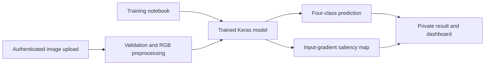

# Alzheimer Image Classification

This repository contains a research prototype for classifying Alzheimer brain images and visualizing which pixels influenced each prediction. It includes the training notebook and a secured Flask web application with authentication, upload history, saliency maps, and an optional educational chatbot.


## Features

- Four-class image classification:
  - `MildDemented`
  - `ModerateDemented`
  - `NonDemented`
  - `VeryMildDemented`
- Input-gradient saliency maps for model interpretability
- Account registration and login with hashed passwords
- CSRF-protected forms and authenticated access to uploaded images
- Validated JPG, JPEG, and PNG uploads with a 10 MB limit
- Private upload history backed by SQLite
- Optional Gemini-powered educational chatbot
- Kaggle/Google Colab training workflow

## Project flow



## Methodology

### Dataset and preprocessing

The notebook uses the Kaggle `yasserhessein/dataset-alzheimer` image dataset with four directory-based labels. In the recorded run, the data generator found 5,121 training images and 1,279 test images. Because the notebook reads one 5,000-image batch from the training generator and one 1,279-image batch from the test generator, 6,279 images are subsequently combined and randomly split.

The resulting arrays recorded in the notebook are:

| Subset | Images | Approximate share |
| --- | ---: | ---: |
| Training | 4,395 | 70% |
| Validation | 628 | 10% |
| Test/evaluation | 1,256 | 20% |

Images are resized to `176 x 208` pixels with three color channels and rescaled to the `[0, 1]` range. The training generator applies mild zoom (`0.99-1.01`) and brightness augmentation (`0.8-1.2`); the test generator applies rescaling without augmentation.

The notebook recombines the dataset's original training and test directories before making a new random split. Therefore, the reported test result is an internal experimental result, not a score on the dataset's original untouched test partition.

### Model architecture

The primary saved model is a custom convolutional neural network:

1. Two standard `Conv2D` layers with 16 filters, followed by max pooling.
2. Separable-convolution blocks with 32, 64, 128, and 256 filters. Each block contains two `SeparableConv2D` layers, batch normalization, and max pooling.
3. Dropout after the 128-filter and 256-filter blocks.
4. A flattened feature vector followed by dense blocks of 512, 128, and 64 units. Each dense block uses ReLU, batch normalization, and dropout.
5. A four-unit softmax output layer for the four classes.

The notebook also experiments with a second conventional CNN containing repeated 16-, 32-, 64-, and 128-filter convolution blocks. A separate final test evaluation for that second experiment is not stored in the notebook, so it is not included in the results below.

### Training and evaluation

The primary model uses the Adam optimizer and categorical cross-entropy loss. The recorded run trains for 50 epochs with a batch size of 20. The notebook defines learning-rate, checkpoint, and early-stopping callbacks, but the recorded `model.fit` call does not pass those callbacks; the documented result therefore corresponds to the complete 50-epoch run.

The configured metrics are TensorFlow/Keras `BinaryAccuracy`, `Precision`, `Recall`, and `AUC` applied to one-hot encoded class outputs. This distinction matters when interpreting the numbers: the reported accuracy is element-wise binary accuracy across four output positions, not ordinary top-1 categorical accuracy.

## Implementation

### Training pipeline

The Jupyter notebook performs the research workflow end to end:

1. Authenticate with Kaggle at runtime and download the dataset.
2. Load directory-based labels with `ImageDataGenerator`.
3. Normalize, augment, combine, and split the image arrays.
4. Build and train the custom TensorFlow/Keras CNN.
5. Evaluate the trained model and save it as `full_model.keras`.
6. Explore gradient-based model explanations, including Grad-CAM experiments in the notebook.

### Web application pipeline

The Flask application implements the deployment workflow:

1. Register or authenticate a user with a salted password hash.
2. Accept a JPG, JPEG, or PNG file up to 10 MB.
3. Decode the file, convert OpenCV BGR pixels to RGB, resize to `176 x 208`, and normalize to `[0, 1]`.
4. Load the trusted local Keras model lazily and calculate the four-class probability output.
5. Select the class with the largest output score.
6. Calculate an input-gradient saliency map for that selected class.
7. Store the uploaded image and saliency map outside the public static directory under randomized filenames.
8. Record only the owning user, filenames, prediction, and UTC timestamp in SQLite.
9. Serve stored images through an authenticated ownership check.

The optional chatbot is stateless between requests, uses the Gemini API only when `GOOGLE_API_KEY` is configured, and is prompted to provide educational—not diagnostic—information.

## Recorded results

The original notebook contains the following evaluation output for the primary saved model on the 1,256-image internal test array:

| Metric | Recorded value |
| --- | ---: |
| Test loss | 0.1551 |
| Binary accuracy | 0.9717 |
| Precision | 0.9442 |
| Recall | 0.9427 |
| AUC | 0.9951 |

These values reproduce what was printed by the saved notebook run; they have not been independently rerun as part of this cleaned repository. They should not be interpreted as clinical accuracy because:

- `BinaryAccuracy` is not the same as four-class top-1 accuracy.
- The original dataset partitions were recombined and randomly split.
- No fixed random seed is shown for the recorded split, so a new run can produce different subsets and metrics.
- No external dataset, patient-level holdout, calibration analysis, or clinical validation is included.
- Class-specific sensitivity, specificity, and confidence intervals are not reported.

For a stronger evaluation, retain an untouched external test set, split at the patient level where identifiers are available, use categorical accuracy and per-class precision/recall/F1, publish the confusion matrix, and report uncertainty across repeated seeded runs.

## Repository structure

```text
.
|-- alzheimer_classification.ipynb  # Cleaned training notebook
|-- requirements.txt                # Notebook and web-app dependencies
|-- webapp/
|   |-- .env.example                # Safe configuration template
|   |-- app.py                      # Flask application and saliency logic
|   `-- templates/                  # Application pages
`-- .gitignore                      # Excludes secrets, scans, models, and local data
```

Trained models, downloaded datasets, credentials, databases, uploaded medical images, and generated saliency images are deliberately excluded from Git.

## Training the model

Open `alzheimer_classification.ipynb` in Google Colab or Jupyter. The notebook downloads the `yasserhessein/dataset-alzheimer` dataset through the Kaggle CLI, prepares the four classes, trains the model, evaluates it, and saves `full_model.keras`.

Kaggle credentials are private. Download `kaggle.json` from your Kaggle account and provide it only at runtime. Never commit it to this repository.

The committed notebook has its saved outputs removed to keep the repository small. Running it will regenerate plots, metrics, and the trained model.

## Running the web application

### 1. Create a virtual environment

```bash
python -m venv .venv
```

Activate it on Windows PowerShell:

```powershell
.\.venv\Scripts\Activate.ps1
```

On macOS or Linux:

```bash
source .venv/bin/activate
```

### 2. Install dependencies

```bash
python -m pip install --upgrade pip
pip install -r requirements.txt
```

### 3. Configure the application

Copy the example environment file:

```powershell
Copy-Item webapp/.env.example webapp/.env
```

On macOS or Linux:

```bash
cp webapp/.env.example webapp/.env
```

Edit `webapp/.env` and replace `SECRET_KEY` with a long random value. You can generate one with:

```bash
python -c "import secrets; print(secrets.token_hex(32))"
```

`GOOGLE_API_KEY` is optional and is required only for the chatbot. Keep all real keys in `webapp/.env`; this file is ignored by Git.

### 4. Add the trained model

Create `webapp/models/` and place the trained model at:

```text
webapp/models/full_model.keras
```

Alternatively, set `MODEL_PATH` in `webapp/.env` to the model's absolute or relative path. Model files are intentionally ignored because they are generated binaries and can be large.

### 5. Start the server

```bash
python webapp/app.py
```

Open <http://127.0.0.1:5000> in a browser.

## Saliency maps

The deployed web application uses an **input-gradient saliency map**. This differs from Grad-CAM: Grad-CAM explains a prediction using activations from a convolutional layer, while the deployed method measures the gradient directly at the input pixels.

For an uploaded image, the application:

1. Adds a batch dimension and asks the model for its four output scores.
2. Chooses the output corresponding to the predicted class.
3. Uses TensorFlow `GradientTape` to calculate the derivative of that score with respect to every input pixel and color channel.
4. Takes the absolute gradient because both positive and negative local changes can strongly influence the score.
5. Reduces the three RGB-channel values to one value per pixel using the maximum magnitude.
6. Safely min-max normalizes the map with `divide_no_nan`, converts it to an 8-bit image, and applies a hot colormap.

Brighter pixels represent greater **local sensitivity** of the selected model score. They do not necessarily represent anatomical abnormalities, disease-specific regions, or pixels the model used in a human-like way. The map can emphasize edges, background patterns, preprocessing artifacts, scanner markings, or noise.

Saliency maps are also sensitive to small input or model changes and do not show whether a region increased or decreased the class score after the absolute value is taken. They should be treated as a debugging and interpretability aid—not as segmentation, localization ground truth, confidence measurement, causal evidence, or a clinical explanation.

The notebook additionally contains experimental Grad-CAM code. The web interface intentionally describes its generated output as input-gradient saliency so the two explanation methods are not conflated.

## Privacy and security

- Passwords are stored as salted hashes rather than plain text.
- Forms and JSON chat requests use CSRF protection.
- Uploaded images receive random filenames and are stored outside the public static directory.
- Users can retrieve only files associated with their own account.
- Session cookies are HTTP-only and use `SameSite=Lax`.
- File extensions and request sizes are validated.
- Debug mode is disabled.
- API keys, databases, model files, uploads, and generated saliency maps are ignored by Git.

For an HTTPS deployment, set `SESSION_COOKIE_SECURE=true`. Use a production WSGI server and a persistent secret instead of Flask's development server.

## Data and model limitations

- Model quality depends on the source dataset, label quality, preprocessing, and evaluation design.
- Performance on the training dataset does not establish clinical validity or generalization to other scanners and populations.
- The application accepts images for research demonstration only.
- Confirm the dataset's current license and terms before redistributing any data.
- Do not upload identifiable or sensitive patient data to an untrusted deployment.

## Generated local files

The application creates these paths at runtime, and Git ignores them:

```text
webapp/instance/site.db
webapp/instance/uploads/
webapp/models/
webapp/.env
```
