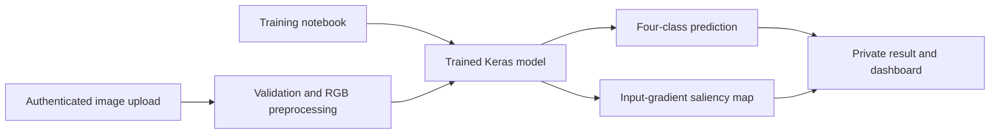

# Alzheimer Image Classification

This repository contains a research prototype for classifying Alzheimer brain images and visualizing which pixels influenced each prediction. It includes the training notebook and a secured Flask web application with authentication, upload history, saliency maps, and an optional educational chatbot.

> [!WARNING]
> This project is for education and research only. Its predictions and saliency maps are not medical diagnoses and must not replace evaluation by a qualified healthcare professional.

## Features

- Four-class image classification:
  - `MildDemented`
  - `ModerateDemented`
  - `NonDemented`
  - `VeryMildDemented`
- Input-gradient saliency maps for model interpretability
- Account registration and login with hashed passwords
- CSRF-protected forms and authenticated access to uploaded images
- Validated JPG, JPEG, and PNG uploads with a 10 MB limit
- Private upload history backed by SQLite
- Optional Gemini-powered educational chatbot
- Kaggle/Google Colab training workflow

## Project flow



## Repository structure

```text
.
|-- alzheimer_classification.ipynb  # Cleaned training notebook
|-- requirements.txt                # Notebook and web-app dependencies
|-- webapp/
|   |-- .env.example                # Safe configuration template
|   |-- app.py                      # Flask application and saliency logic
|   `-- templates/                  # Application pages
`-- .gitignore                      # Excludes secrets, scans, models, and local data
```

Trained models, downloaded datasets, credentials, databases, uploaded medical images, and generated saliency images are deliberately excluded from Git.

## Training the model

Open `alzheimer_classification.ipynb` in Google Colab or Jupyter. The notebook downloads the `yasserhessein/dataset-alzheimer` dataset through the Kaggle CLI, prepares the four classes, trains the model, evaluates it, and saves `full_model.keras`.

Kaggle credentials are private. Download `kaggle.json` from your Kaggle account and provide it only at runtime. Never commit it to this repository.

The committed notebook has its saved outputs removed to keep the repository small. Running it will regenerate plots, metrics, and the trained model.

## Running the web application

### 1. Create a virtual environment

```bash
python -m venv .venv
```

Activate it on Windows PowerShell:

```powershell
.\.venv\Scripts\Activate.ps1
```

On macOS or Linux:

```bash
source .venv/bin/activate
```

### 2. Install dependencies

```bash
python -m pip install --upgrade pip
pip install -r requirements.txt
```

### 3. Configure the application

Copy the example environment file:

```powershell
Copy-Item webapp/.env.example webapp/.env
```

On macOS or Linux:

```bash
cp webapp/.env.example webapp/.env
```

Edit `webapp/.env` and replace `SECRET_KEY` with a long random value. You can generate one with:

```bash
python -c "import secrets; print(secrets.token_hex(32))"
```

`GOOGLE_API_KEY` is optional and is required only for the chatbot. Keep all real keys in `webapp/.env`; this file is ignored by Git.

### 4. Add the trained model

Create `webapp/models/` and place the trained model at:

```text
webapp/models/full_model.keras
```

Alternatively, set `MODEL_PATH` in `webapp/.env` to the model's absolute or relative path. Model files are intentionally ignored because they are generated binaries and can be large.

### 5. Start the server

```bash
python webapp/app.py
```

Open <http://127.0.0.1:5000> in a browser.

## Saliency maps

For the predicted class, the application differentiates the model score with respect to every input pixel. It takes the maximum absolute gradient across the color channels, normalizes the result safely, and saves a heatmap. A brighter area indicates that a small change in those pixels could have a larger effect on the selected score.

A saliency map shows model sensitivity, not clinical evidence or causal importance. It can also highlight noise, borders, or dataset artifacts.

## Privacy and security

- Passwords are stored as salted hashes rather than plain text.
- Forms and JSON chat requests use CSRF protection.
- Uploaded images receive random filenames and are stored outside the public static directory.
- Users can retrieve only files associated with their own account.
- Session cookies are HTTP-only and use `SameSite=Lax`.
- File extensions and request sizes are validated.
- Debug mode is disabled.
- API keys, databases, model files, uploads, and generated saliency maps are ignored by Git.

For an HTTPS deployment, set `SESSION_COOKIE_SECURE=true`. Use a production WSGI server and a persistent secret instead of Flask's development server.

## Data and model limitations

- Model quality depends on the source dataset, label quality, preprocessing, and evaluation design.
- Performance on the training dataset does not establish clinical validity or generalization to other scanners and populations.
- The application accepts images for research demonstration only.
- Confirm the dataset's current license and terms before redistributing any data.
- Do not upload identifiable or sensitive patient data to an untrusted deployment.

## Generated local files

The application creates these paths at runtime, and Git ignores them:

```text
webapp/instance/site.db
webapp/instance/uploads/
webapp/models/
webapp/.env
```
